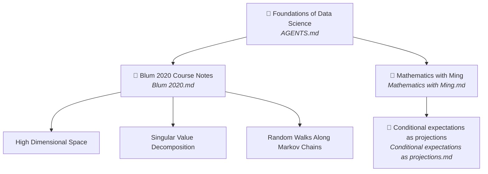

# Foundations of Data Science – Project Memory

## Activity Setup
Follow the Activity Setup Guide at: `C:\Users\dkill\OneDrive\Documents\ActivitySetupGuide.md`
Read this at the start of each session to initialize or resume any activity within this workspace.

## Overview
Course notes and learning activities in data science, organized around two activities:
**Blum 2020 Course Notes** (working through the textbook) and **Mathematics with Ming**
(standalone learning sessions).

## Activities

| Activity | Folder | Memory file |
|----------|--------|-------------|
| Blum 2020 Course Notes | *(project root)* | `Blum 2020.md` |
| Mathematics with Ming | `Mathematics with Ming/` | `Mathematics with Ming/Mathematics with Ming.md` |

## Coding style / conventions

**Style guide:** `C:\Users\dkill\OneDrive\Documents\prep (May 2025).R`
This is the global setup script and authoritative style reference. It defines:
- Package lists (base, viz, graph, model, Bayes, tables) and `pckg_load()` helper
- ggplot2 themes: `base` (default), `base_ppt` (presentations), `faceted`, `facet_style()`
- USAID color palette: `medium_blue` `#0067B9`, `usaid_red` `#BA0C2F`, `light_grey` `#CFCDC9`, and others
- `flextable` defaults (Gill Sans MT, 10pt)

Additional conventions not in the prep file:
- Base R pipe `|>` (not magrittr `%>%`)
- `plotly` + `htmltools` for interactive widgets
- Interactive widgets use tab buttons with animated sliders (custom CSS per section)
- Code chunks: visible by default; `#| echo: false` for plotting code and large widget blocks
- `set.seed()` uses arbitrary integers (not 42/123)
- Sections follow pattern: application → derivation → simulation/visualization
