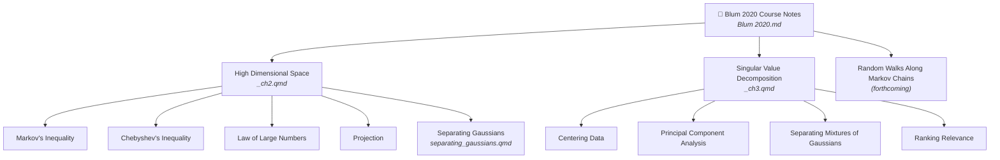

# Blum 2020 Course Notes – Activity Memory

## Parent Project
Foundations of Data Science — `AGENTS.md`

## Overview
Course notes for **Foundations of Data Science** by Blum, Hopcroft & Kannan (2020).
Published at: https://dkillian.github.io/FoundationsDataScience/

## Key files
- `Foundations of Data Science (Blum 2020).pdf` — Source textbook (486 pages)
- `prep (May 2025).R` — Global setup: loads libraries, sets themes/palettes (sourced in YAML)
- `ch2_text.txt`, `ch3_text.txt` — Extracted plain text of Chapters 2–3

## Structure

## Activities

### High Dimensional Space
`Foundations of Data Science_ch2.qmd`

| Task | Published URL | Status |
|------|---------------|--------|
| Markov's Inequality | https://dkillian.github.io/FoundationsDataScience/markov_inequality.html | Complete |
| Chebyshev's Inequality | — | Complete |
| Law of Large Numbers | — | Complete |
| Projection | — | — |
| Separating Gaussians | — | In progress — `separating_gaussians.qmd` |

**Outstanding work:**
1. **Fix Section 2.8 (Master Tail Bounds)**: Write-up described a general E[g(X)]/g(a) framework. Blum's Theorem 2.5 is a *specific* exponential concentration result: P(|x| ≥ a) ≤ 3e^{−a²/(12nσ²)}. Needs rewrite.
2. **Fix Section 2.6 (Gaussian Annulus)**: Current derivation gives a Chebyshev-based polynomial bound. Blum's Theorem 2.9 gives a tighter exponential bound (≤ 3e^{−cβ²}). Tighter result should be noted.
3. **Unwritten sections**: 2.3 Geometry of High Dimensions, 2.4 Unit Ball, 2.5 Uniform Points on Ball, 2.6 Gaussians in High Dimension, 2.7 Johnson-Lindenstrauss, 2.8 Separating Gaussians, 2.9 Fitting a Spherical Gaussian.

### Singular Value Decomposition
`Foundations of Data Science_ch3.qmd`

| Task | Published URL | Status |
|------|---------------|--------|
| Centering Data | — | — |
| Principal Component Analysis | — | — |
| Separating Mixtures of Gaussians | — | — |
| Ranking Relevance | — | — |

### Random Walks Along Markov Chains
*(forthcoming)*
