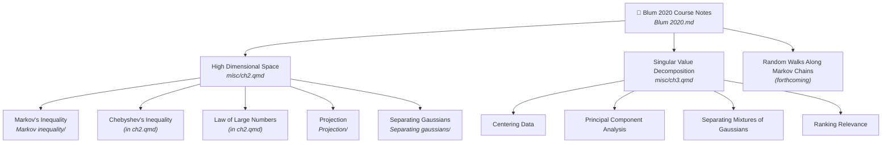

# Blum 2020 Course Notes – Activity Memory

## Parent Project
Foundations of Data Science — `../AGENTS.md`

## Overview
Course notes for **Foundations of Data Science** by Blum, Hopcroft & Kannan (2020).
Published at: https://dkillian.github.io/FoundationsDataScience/

## Key files
- `Foundations of Data Science (Blum 2020).pdf` — Source textbook (486 pages)
- `C:/Users/dkill/OneDrive/Documents/prep (May 2025).R` — Global setup (sourced in all .qmd files as `../../prep (May 2025).R`)

## Folder structure

```
Blum 2020/
├── Markov inequality/          markov_inequality.qmd
├── Separating gaussians/       separating_gaussians.qmd
├── Projection/                 Projection.R  Projection.qmd  Projection_lesson.qmd
└── misc/                       ch2.qmd  ch3.qmd  ch2_shiny.qmd  ch2_text.txt  ch3_text.txt
```

## Structure



## Tasks

### High Dimensional Space — `misc/Foundations of Data Science_ch2.qmd`

| Task | Folder | Status |
|------|--------|--------|
| Markov's Inequality | `Markov inequality/` | Complete — application, derivation, Plotly widget (6 distributions) |
| Chebyshev's Inequality | *(in ch2.qmd)* | Complete — application, derivation, Plotly widget (5 distributions) |
| Law of Large Numbers | *(in ch2.qmd)* | Complete — derivation via Chebyshev, 3-distribution simulation |
| Chernoff Bounds | *(in ch2.qmd)* | Complete — MGF derivation, Binomial example |
| Higher Moments | *(in ch2.qmd)* | Complete — k-th moment bound, Exponential(1) example |
| Gaussian Annulus | *(in ch2.qmd)* | Complete — needs revision (see below) |
| Power Law Distributions | *(in ch2.qmd)* | Complete |
| Master Tail Bounds | *(in ch2.qmd)* | Complete — needs revision (see below) |
| Projection | `Projection/` | Active — `Projection.R` / `Projection.qmd` / `Projection_lesson.qmd` |
| Separating Gaussians | `Separating gaussians/` | In progress |

### Singular Value Decomposition — `misc/Foundations of Data Science_ch3.qmd`

| Task | Status |
|------|--------|
| Centering Data | — |
| Principal Component Analysis | — |
| Separating Mixtures of Gaussians | — |
| Ranking Relevance | — |

### Random Walks Along Markov Chains
*(forthcoming)*

## Outstanding work
1. **Fix Section 2.8 (Master Tail Bounds)**: Write-up described a general E[g(X)]/g(a) framework. Blum's Theorem 2.5 is a *specific* exponential result: P(|x| ≥ a) ≤ 3e^{−a²/(12nσ²)}. Needs rewrite.
2. **Fix Section 2.6 (Gaussian Annulus)**: Current derivation gives a Chebyshev-based polynomial bound. Blum's Theorem 2.9 gives a tighter exponential bound (≤ 3e^{−cβ²}). Tighter result should be noted.
