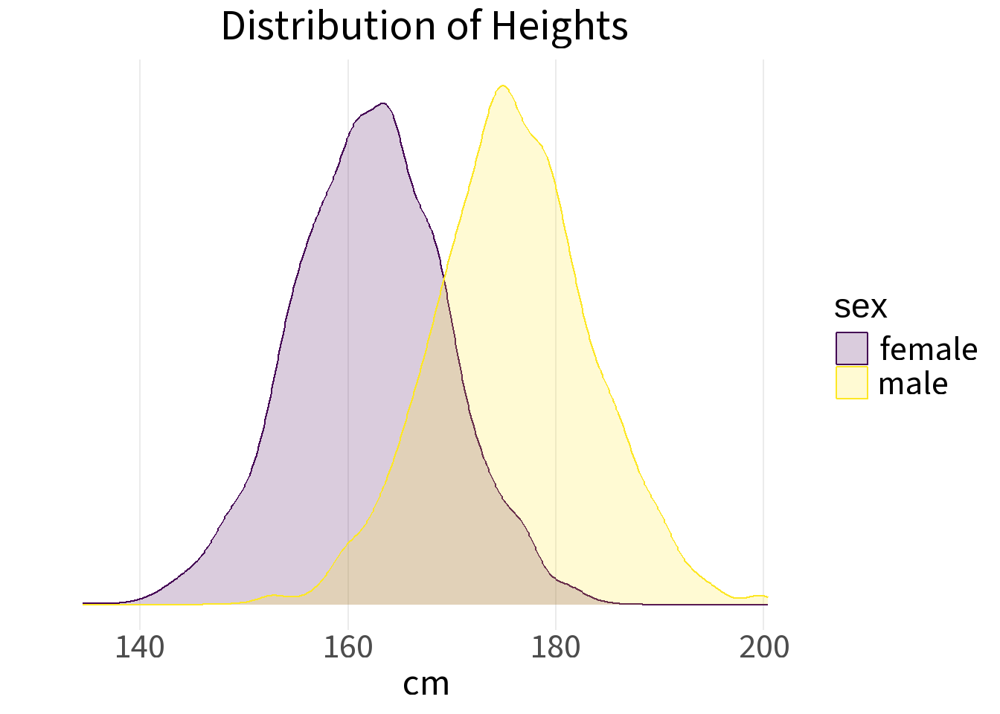
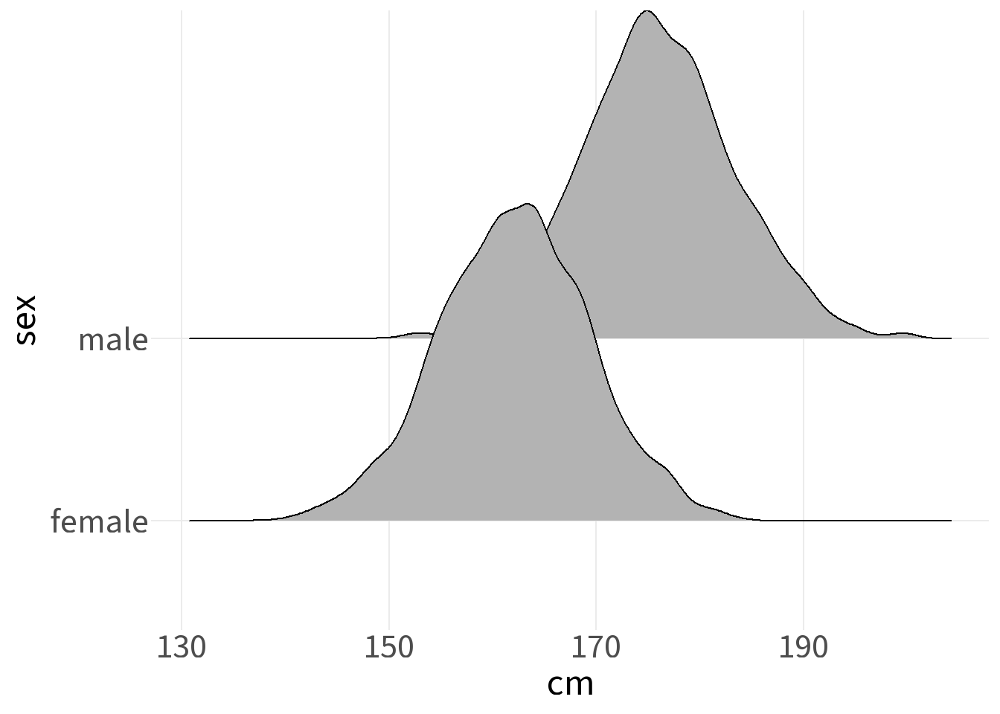
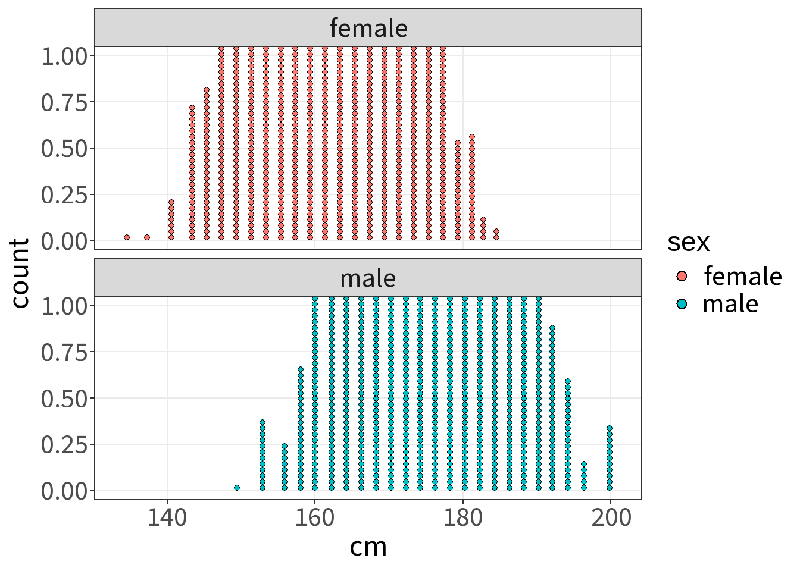
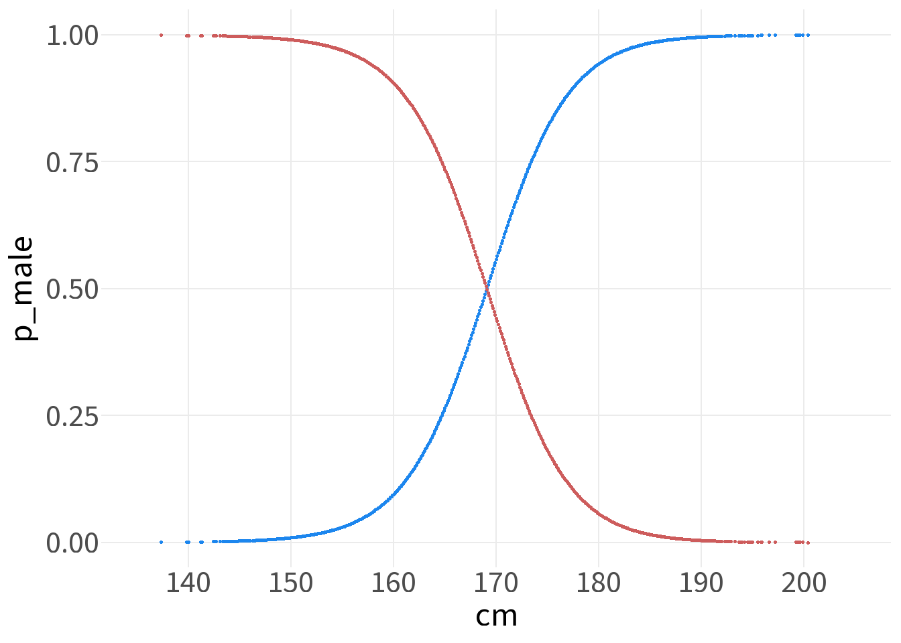

## The Problem

We observe a sample of heights and know that it was drawn from a population composed of two groups — female and male — each with its own distribution of heights. The question is: given only a height measurement, what is the probability that the observation came from each group?

We model each group's heights as Gaussian, so the full population is a **Gaussian mixture**:

$$f(x) = \pi_f \cdot \phi(x; \mu_f, \sigma_f) + \pi_m \cdot \phi(x; \mu_m, \sigma_m)$$

where $\phi(x; \mu, \sigma)$ is the Gaussian density and $\pi_k$ is the **mixture weight** for group $k$ — the prior probability that a randomly drawn person belongs to that group.

### The data

::: cell
``` {.r .cell-code}
library(NHANES)

heights <- NHANES |>
    filter(Age >= 20, !is.na(Height), !is.na(Gender)) |>
    select(sex=Gender, age=Age, cm=Height) %>%
    mutate(inches=round(cm/2.54,0),
           ft=floor(inches/12),
           rem=round(inches%% 12,1),
           feet=round(inches/12,1),
           feet_lab = paste(ft, "'", rem, "\"", sep=""))
```
:::

:::: cell
``` {.r .cell-code}
library(flextable)

parms <- heights |>
  group_by(sex) |>
  summarise(
    n       = n(),
    mean_cm = mean(cm, na.rm = TRUE),
    sd_cm   = sd(cm,   na.rm = TRUE)
  ) 

prior_f <- parms$n[1] / sum(parms$n)
prior_m <- parms$n[2] / sum(parms$n)

parms_flx <- parms |>
    mutate(weight = n / sum(n)) |>
    select(sex, n, weight, mean_cm, sd_cm) |>
    flextable() |>
    colformat_double(j = "weight", digits = 3) |>
    colformat_double(j = c("mean_cm", "sd_cm"), digits = 1)

parms_flx
```

::: cell-output-display
```{=html}
<div class="tabwid"><style>.cl-e841711c{table-layout:auto;}.cl-e8365a52{font-family:'Gill Sans MT';font-size:10pt;font-weight:normal;font-style:normal;text-decoration:none;color:rgba(0, 0, 0, 1.00);background-color:transparent;}.cl-e83b9eae{margin:0;text-align:left;border-bottom: 0 solid rgba(0, 0, 0, 1.00);border-top: 0 solid rgba(0, 0, 0, 1.00);border-left: 0 solid rgba(0, 0, 0, 1.00);border-right: 0 solid rgba(0, 0, 0, 1.00);padding-bottom:5pt;padding-top:5pt;padding-left:5pt;padding-right:5pt;line-height: 1;background-color:transparent;}.cl-e83b9eb8{margin:0;text-align:right;border-bottom: 0 solid rgba(0, 0, 0, 1.00);border-top: 0 solid rgba(0, 0, 0, 1.00);border-left: 0 solid rgba(0, 0, 0, 1.00);border-right: 0 solid rgba(0, 0, 0, 1.00);padding-bottom:5pt;padding-top:5pt;padding-left:5pt;padding-right:5pt;line-height: 1;background-color:transparent;}.cl-e83bdf72{background-color:transparent;vertical-align: middle;border-bottom: 1.5pt solid rgba(102, 102, 102, 1.00);border-top: 1.5pt solid rgba(102, 102, 102, 1.00);border-left: 0 solid rgba(0, 0, 0, 1.00);border-right: 0 solid rgba(0, 0, 0, 1.00);margin-bottom:0;margin-top:0;margin-left:0;margin-right:0;}.cl-e83bdf7c{background-color:transparent;vertical-align: middle;border-bottom: 1.5pt solid rgba(102, 102, 102, 1.00);border-top: 1.5pt solid rgba(102, 102, 102, 1.00);border-left: 0 solid rgba(0, 0, 0, 1.00);border-right: 0 solid rgba(0, 0, 0, 1.00);margin-bottom:0;margin-top:0;margin-left:0;margin-right:0;}.cl-e83bdf7d{background-color:transparent;vertical-align: middle;border-bottom: 0 solid rgba(0, 0, 0, 1.00);border-top: 0 solid rgba(0, 0, 0, 1.00);border-left: 0 solid rgba(0, 0, 0, 1.00);border-right: 0 solid rgba(0, 0, 0, 1.00);margin-bottom:0;margin-top:0;margin-left:0;margin-right:0;}.cl-e83bdf86{background-color:transparent;vertical-align: middle;border-bottom: 0 solid rgba(0, 0, 0, 1.00);border-top: 0 solid rgba(0, 0, 0, 1.00);border-left: 0 solid rgba(0, 0, 0, 1.00);border-right: 0 solid rgba(0, 0, 0, 1.00);margin-bottom:0;margin-top:0;margin-left:0;margin-right:0;}.cl-e83bdf87{background-color:transparent;vertical-align: middle;border-bottom: 1.5pt solid rgba(102, 102, 102, 1.00);border-top: 0 solid rgba(0, 0, 0, 1.00);border-left: 0 solid rgba(0, 0, 0, 1.00);border-right: 0 solid rgba(0, 0, 0, 1.00);margin-bottom:0;margin-top:0;margin-left:0;margin-right:0;}.cl-e83bdf90{background-color:transparent;vertical-align: middle;border-bottom: 1.5pt solid rgba(102, 102, 102, 1.00);border-top: 0 solid rgba(0, 0, 0, 1.00);border-left: 0 solid rgba(0, 0, 0, 1.00);border-right: 0 solid rgba(0, 0, 0, 1.00);margin-bottom:0;margin-top:0;margin-left:0;margin-right:0;}</style><table data-quarto-disable-processing='true' class='cl-e841711c'><thead><tr style="overflow-wrap:break-word;"><th class="cl-e83bdf72"><p class="cl-e83b9eae"><span class="cl-e8365a52">sex</span></p></th><th class="cl-e83bdf7c"><p class="cl-e83b9eb8"><span class="cl-e8365a52">n</span></p></th><th class="cl-e83bdf7c"><p class="cl-e83b9eb8"><span class="cl-e8365a52">weight</span></p></th><th class="cl-e83bdf7c"><p class="cl-e83b9eb8"><span class="cl-e8365a52">mean_cm</span></p></th><th class="cl-e83bdf7c"><p class="cl-e83b9eb8"><span class="cl-e8365a52">sd_cm</span></p></th></tr></thead><tbody><tr style="overflow-wrap:break-word;"><td class="cl-e83bdf7d"><p class="cl-e83b9eae"><span class="cl-e8365a52">female</span></p></td><td class="cl-e83bdf86"><p class="cl-e83b9eb8"><span class="cl-e8365a52">3,658</span></p></td><td class="cl-e83bdf86"><p class="cl-e83b9eb8"><span class="cl-e8365a52">0.509</span></p></td><td class="cl-e83bdf86"><p class="cl-e83b9eb8"><span class="cl-e8365a52">162.0</span></p></td><td class="cl-e83bdf86"><p class="cl-e83b9eb8"><span class="cl-e8365a52">7.3</span></p></td></tr><tr style="overflow-wrap:break-word;"><td class="cl-e83bdf87"><p class="cl-e83b9eae"><span class="cl-e8365a52">male</span></p></td><td class="cl-e83bdf90"><p class="cl-e83b9eb8"><span class="cl-e8365a52">3,524</span></p></td><td class="cl-e83bdf90"><p class="cl-e83b9eb8"><span class="cl-e8365a52">0.491</span></p></td><td class="cl-e83bdf90"><p class="cl-e83b9eb8"><span class="cl-e8365a52">175.8</span></p></td><td class="cl-e83bdf90"><p class="cl-e83b9eb8"><span class="cl-e8365a52">7.5</span></p></td></tr></tbody></table></div>
```
:::
::::

:::: cell
``` {.r .cell-code}
ggplot(heights, aes(x=cm, color=sex, fill=sex)) +
    geom_density(alpha=.2) +
    scale_fill_viridis_d() +
    scale_color_viridis_d() +
    scale_y_continuous(breaks=NULL) +
    labs(y="",
         title="Distribution of Heights")
```

::: cell-output-display
{width="672"}
:::
::::

It is clear that there is lots of overlap in the heights of men and women. Short men and tall women cannot be distinguished.

Given the overlap, no height provides certainty — but we can do better than a coin flip. If we model each group's heights as Gaussian and use each group's share of the sample as a prior, Bayes' theorem gives us a posterior probability for any observed height.

### Posterior probability

We want $P(\text{female} \mid h)$ — the probability that a person of height $h$ is female. By Bayes' theorem:

$$P(\text{female} \mid h) = \frac{P(h \mid \text{female}) \cdot \pi_f}{P(h \mid \text{female}) \cdot \pi_f \;+\; P(h \mid \text{male}) \cdot \pi_m}$$

Each term has a clear role:

- $P(h \mid \text{female}) = \phi(h;\, \mu_f, \sigma_f)$ is the **likelihood** — how probable is this height under the female Gaussian?
- $\pi_f$ is the **prior** — what fraction of the population is female, before observing height?
- The denominator is the total probability of observing height $h$ across both groups, ensuring the posteriors sum to 1.

Crucially, $P(\text{male} \mid h) = 1 - P(\text{female} \mid h)$, so only one calculation is needed.

### Mixture weights

The mixture weight $\pi_k$ is the share of the total sample belonging to group $k$:

$$\pi_k = \frac{n_k}{N}, \qquad N = \sum_k n_k$$ For this dataset, $\pi_f =$ 0.509 and $\pi_m =$ 0.491. These reflect the sample composition and serve as **prior probabilities** before observing any height.

Without mixture weights, we would implicitly treat each group as equally probable — equivalent to setting $\pi_f = \pi_m = 0.5$. When the groups differ in size, this introduces a systematic bias in classification.

::: cell
``` {.r .cell-code}
heights <- heights |>
    mutate(lik_female = dnorm(cm,
                            mean=parms$mean_cm[1],
                            sd=parms$sd_cm[1]),
           lik_male = dnorm(cm,
                            mean = parms$mean_cm[2],
                            sd = parms$sd_cm[2]),
           p_female   = (lik_female * prior_f) / 
               (lik_female * prior_f + lik_male * prior_m),
           p_male = ( lik_male * prior_m ) / 
               ( (lik_male * prior_m) + (lik_female * prior_f) )
    )

heights <- heights %>%
    group_by(sex) %>%
    mutate(percentile=cume_dist(cm))
```
:::

::::: cell
``` {.r .cell-code}
library(ggridges)

ggplot(heights, aes(x = cm, y = sex)) +
  geom_density_ridges()
```

::: {.cell-output .cell-output-stderr}
```         
Picking joint bandwidth of 1.27
```
:::

::: cell-output-display
{width="672"}
:::
:::::

:::: cell
``` {.r .cell-code}
ggplot(heights, aes(x = cm, fill = sex)) +
  geom_dotplot(binwidth = 2, dotsize=.4) +
    scale_x_continuous(breaks=seq(100, 220, 20)) +
  facet_wrap(~ sex, ncol = 1) + 
    faceted
```

::: cell-output-display
{width="672"}
:::
::::

:::: cell
``` {.r .cell-code}
ggplot(heights, aes(cm)) +
    geom_point(aes(y=p_male),
               size=.5,
               color="dodgerblue2") +
    geom_point(aes(y=p_female),
               size=.5,
               color="indianred") +
    scale_x_continuous(limits=c(135,205),
                       breaks=seq(140,200,10))
```

::: cell-output-display
{width="672"}
:::
::::

## The Geometry

## The Algorithm

## Simulation
