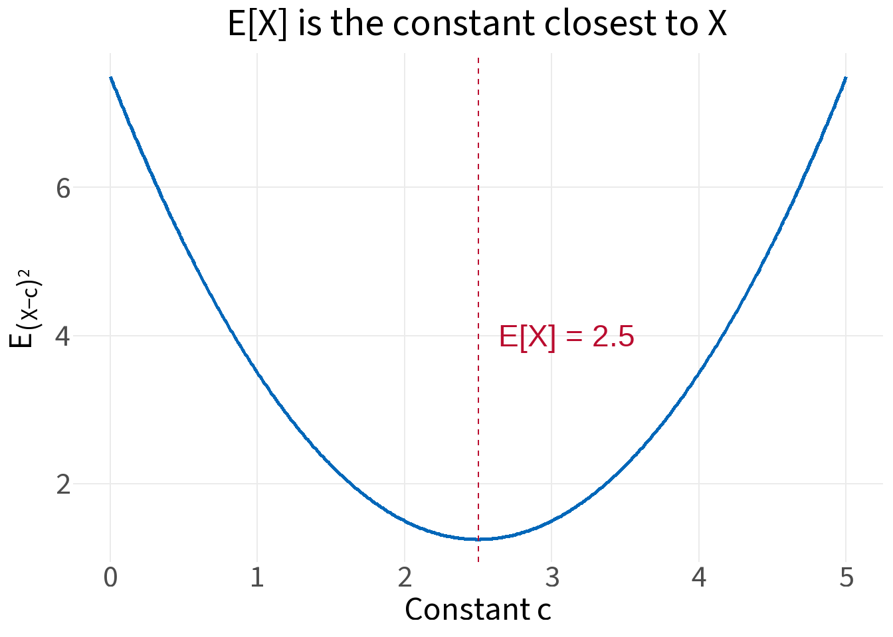
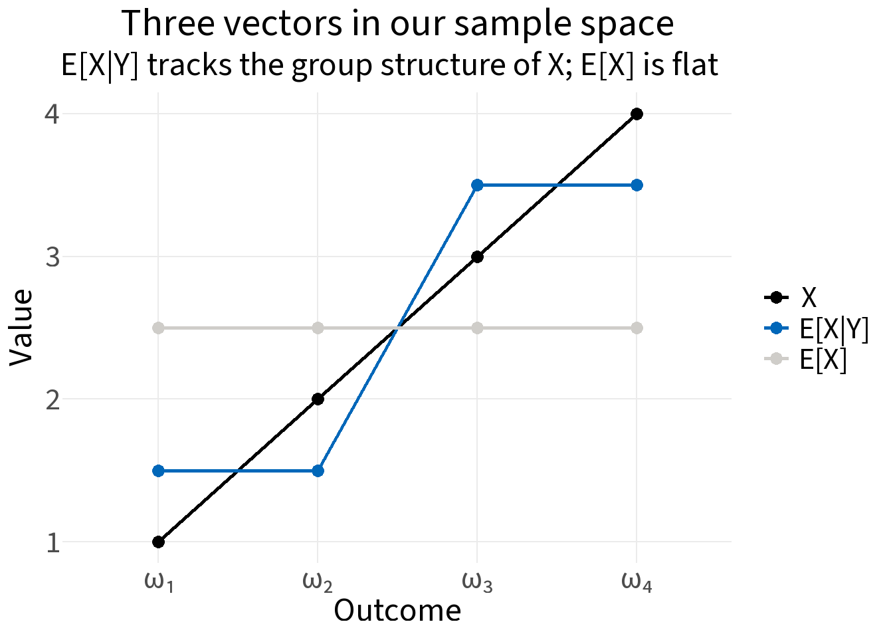
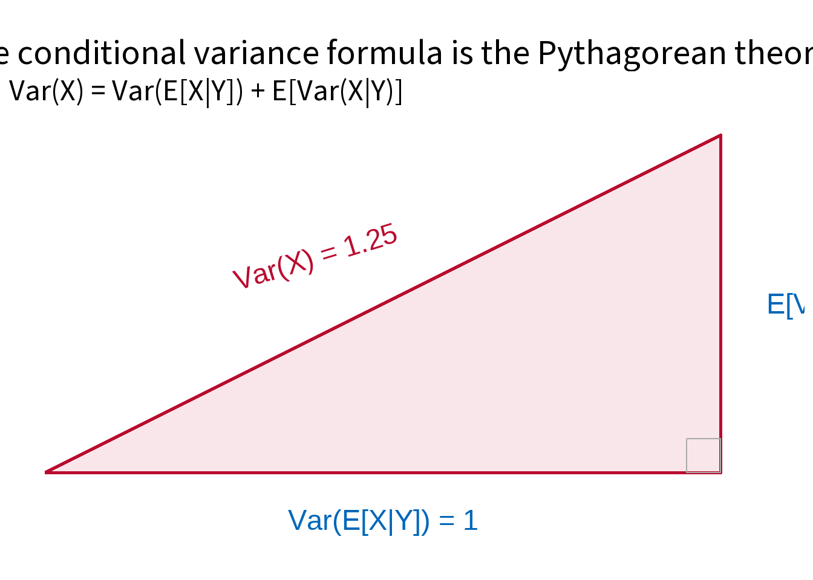

## The big idea

This note works through a single concrete example to build geometric intuition for conditional expectations.

The central claim, from the video [*Conditional Expectations Are Just Projections*](https://www.youtube.com/watch?v=q5D7w_i2JPg), is this:

> **Conditional expectations are orthogonal projections** in the space of square-integrable (L2) random variables.

That one idea — projection — turns out to explain all the standard rules: the tower property, the take-out-what's-given rule, and the conditional variance formula (EVE's law). And it turns out the conditional variance formula is nothing more than the Pythagorean theorem.

---

## The setup

We work in a tiny world: four equally likely outcomes, ω₁ through ω₄. On each outcome we observe two quantities, Y (a coin flip) and X (a number that tends to be larger when Y = 1).


::: {.cell}

```{.r .cell-code}
omega <- data.frame(
  outcome = c("ω₁", "ω₂", "ω₃", "ω₄"),
  Y = c(0, 0, 1, 1),
  X = c(1, 2, 3, 4)
)

omega
```

::: {.cell-output-display}

```{=html}
<table class="huxtable" data-quarto-disable-processing="true"  style="margin-left: auto; margin-right: auto;">
<col><col><col><thead>
<tr>
<th class="huxtable-cell huxtable-header" style="border-style: solid solid solid solid; border-width: 0.4pt 0pt 0.4pt 0.4pt;">outcome</th><th class="huxtable-cell huxtable-header" style="text-align: right;  border-style: solid solid solid solid; border-width: 0.4pt 0pt 0.4pt 0pt;">Y</th><th class="huxtable-cell huxtable-header" style="text-align: right;  border-style: solid solid solid solid; border-width: 0.4pt 0.4pt 0.4pt 0pt;">X</th></tr>
</thead>
<tbody>
<tr>
<td class="huxtable-cell" style="border-style: solid solid solid solid; border-width: 0.4pt 0pt 0pt 0.4pt;     background-color: rgb(242, 242, 242);">ω₁</td><td class="huxtable-cell" style="text-align: right;  border-style: solid solid solid solid; border-width: 0.4pt 0pt 0pt 0pt;     background-color: rgb(242, 242, 242);">0</td><td class="huxtable-cell" style="text-align: right;  border-style: solid solid solid solid; border-width: 0.4pt 0.4pt 0pt 0pt;     background-color: rgb(242, 242, 242);">1</td></tr>
<tr>
<td class="huxtable-cell" style="border-style: solid solid solid solid; border-width: 0pt 0pt 0pt 0.4pt;">ω₂</td><td class="huxtable-cell" style="text-align: right;  border-style: solid solid solid solid; border-width: 0pt 0pt 0pt 0pt;">0</td><td class="huxtable-cell" style="text-align: right;  border-style: solid solid solid solid; border-width: 0pt 0.4pt 0pt 0pt;">2</td></tr>
<tr>
<td class="huxtable-cell" style="border-style: solid solid solid solid; border-width: 0pt 0pt 0pt 0.4pt;     background-color: rgb(242, 242, 242);">ω₃</td><td class="huxtable-cell" style="text-align: right;  border-style: solid solid solid solid; border-width: 0pt 0pt 0pt 0pt;     background-color: rgb(242, 242, 242);">1</td><td class="huxtable-cell" style="text-align: right;  border-style: solid solid solid solid; border-width: 0pt 0.4pt 0pt 0pt;     background-color: rgb(242, 242, 242);">3</td></tr>
<tr>
<td class="huxtable-cell" style="border-style: solid solid solid solid; border-width: 0pt 0pt 0.4pt 0.4pt;">ω₄</td><td class="huxtable-cell" style="text-align: right;  border-style: solid solid solid solid; border-width: 0pt 0pt 0.4pt 0pt;">1</td><td class="huxtable-cell" style="text-align: right;  border-style: solid solid solid solid; border-width: 0pt 0.4pt 0.4pt 0pt;">4</td></tr>
</tbody>
</table>

```

:::
:::


**The key conceptual shift:** treat X and Y not just as random variables, but as *vectors*. Each outcome is a coordinate. So X = [1, 2, 3, 4] and Y = [0, 0, 1, 1] are points in 4-dimensional space.

In L2, the **inner product** between two random variables A and B is

$$\langle A, B \rangle = E[AB]$$

For our equally likely outcomes this is just the average of their elementwise products. Two random variables are **orthogonal** when their inner product equals zero: $$E[AB] = 0$$.


::: {.cell}

```{.r .cell-code}
X <- c(1, 2, 3, 4)
Y <- c(0, 0, 1, 1)

# Inner product in L2
inner <- function(A, B) mean(A * B)
```
:::


---

## Step 1: E[X] as a projection onto constants

The unconditional mean E[X] = 2.5 is the best *constant* approximation of X — the constant `c` that minimizes the mean squared error:

$$E[(X - c)^2] = \frac{1}{4} \sum_{i=1}^{4} (x_i - c)^2$$


::: {.cell}
::: {.cell-output-display}
{width=672}
:::
:::


Geometrically, the set of all constant random variables forms a subspace of L2 — the **span of 1**, or vectors of the form [c, c, c, c]. E[X] is the *projection* of X onto this subspace.

---

## Step 2: E[X|Y] as a projection onto functions of Y

Now we allow more flexibility. Instead of a single constant, we can use any *function of Y*. In our example, a function of Y must assign one value when Y = 0 and another when Y = 1 — vectors of the form [a, a, b, b].

The set of all such functions is the subspace $$H_Y$$. We want the element of $$H_Y$$ closest to X:

$$E[X|Y] = \underset{g(Y) \in H_Y}{\arg\min} \; E\left[(X - g(Y))^2\right]$$


::: {.cell}

```{.r .cell-code}
grid <- expand.grid(
  a = seq(0, 3, by = 0.05),   # value assigned when Y = 0
  b = seq(2, 5, by = 0.05)    # value assigned when Y = 1
)

grid$mse <- apply(grid, 1, \(row) {
  g_Y <- c(row["a"], row["a"], row["b"], row["b"])
  mean((X - g_Y)^2)
})

best <- grid[which.min(grid$mse), ]
cat("Best a (for Y = 0):", best$a,
    "\nBest b (for Y = 1):", best$b,
    "\nMinimum MSE:       ", best$mse)
```

::: {.cell-output .cell-output-stdout}

```
Best a (for Y = 0): 1.5 
Best b (for Y = 1): 3.5 
Minimum MSE:        0.25
```


:::
:::


The best function of Y is exactly the **group means** — E[X|Y = 0] = 1.5, E[X|Y = 1] = 3.5. As a vector:

$$E[X|Y] = [1.5,\ 1.5,\ 3.5,\ 3.5]$$

We now have three vectors to compare:


::: {.cell}
::: {.cell-output-display}
{width=672}
:::
:::


The subspaces are nested: constants ⊂ $$H_Y$$ ⊂ L2. E[X] projects onto the smallest; E[X|Y] projects onto a larger one.

---

## Step 3: Orthogonality

The residual after projecting X onto $$H_Y$$ is:

$$X - E[X|Y] = [1, 2, 3, 4] - [1.5, 1.5, 3.5, 3.5] = [-0.5,\ 0.5,\ -0.5,\ 0.5]$$

The key geometric fact: **this residual is orthogonal to every function of Y**.

Intuitively, the residual sums to zero within each Y-group (−0.5 + 0.5 = 0 in both groups). Any function of Y is constant within each group, so multiplying and averaging always cancels.


::: {.cell}

```{.r .cell-code}
resid <- X - EX_Y

data.frame(
  `g(Y)`                       = c("1", "Y", "[1, 1, 3.5, 3.5]", "E[X|Y]"),
  `inner product with residual` = c(
    inner(resid, c(1, 1, 1, 1)),
    inner(resid, c(0, 0, 1, 1)),
    inner(resid, c(1, 1, 3.5, 3.5)),
    inner(resid, EX_Y)
  ),
  check.names = FALSE
)
```

::: {.cell-output-display}

```{=html}
<table class="huxtable" data-quarto-disable-processing="true"  style="margin-left: auto; margin-right: auto;">
<col><col><thead>
<tr>
<th class="huxtable-cell huxtable-header" style="border-style: solid solid solid solid; border-width: 0.4pt 0pt 0.4pt 0.4pt;">g(Y)</th><th class="huxtable-cell huxtable-header" style="text-align: right;  border-style: solid solid solid solid; border-width: 0.4pt 0.4pt 0.4pt 0pt;">inner product with residual</th></tr>
</thead>
<tbody>
<tr>
<td class="huxtable-cell" style="border-style: solid solid solid solid; border-width: 0.4pt 0pt 0pt 0.4pt;     background-color: rgb(242, 242, 242);">1</td><td class="huxtable-cell" style="text-align: right;  border-style: solid solid solid solid; border-width: 0.4pt 0.4pt 0pt 0pt;     background-color: rgb(242, 242, 242);">0</td></tr>
<tr>
<td class="huxtable-cell" style="border-style: solid solid solid solid; border-width: 0pt 0pt 0pt 0.4pt;">Y</td><td class="huxtable-cell" style="text-align: right;  border-style: solid solid solid solid; border-width: 0pt 0.4pt 0pt 0pt;">0</td></tr>
<tr>
<td class="huxtable-cell" style="border-style: solid solid solid solid; border-width: 0pt 0pt 0pt 0.4pt;     background-color: rgb(242, 242, 242);">[1, 1, 3.5, 3.5]</td><td class="huxtable-cell" style="text-align: right;  border-style: solid solid solid solid; border-width: 0pt 0.4pt 0pt 0pt;     background-color: rgb(242, 242, 242);">0</td></tr>
<tr>
<td class="huxtable-cell" style="border-style: solid solid solid solid; border-width: 0pt 0pt 0.4pt 0.4pt;">E[X|Y]</td><td class="huxtable-cell" style="text-align: right;  border-style: solid solid solid solid; border-width: 0pt 0.4pt 0.4pt 0pt;">0</td></tr>
</tbody>
</table>

```

:::
:::


Every inner product is exactly zero.

### Immediate corollary: the tower property

The tower property, $$E[E[X|Y]] = E[X]$$, is just the g(Y) = 1 case. Since $$\langle X - E[X|Y],\ 1 \rangle = 0$$:

$$E[X] - E[E[X|Y]] = 0 \implies E[E[X|Y]] = E[X]$$


::: {.cell}

```{.r .cell-code}
cat("E[X]      =", mean(X), "\nE[E[X|Y]] =", mean(EX_Y))
```

::: {.cell-output .cell-output-stdout}

```
E[X]      = 2.5 
E[E[X|Y]] = 2.5
```


:::
:::


---

## Step 4: The Pythagorean theorem

Center everything by subtracting E[X]. The total deviation of X from its mean splits into two orthogonal pieces:

$$\underbrace{X - E[X]}_{\text{total}} = \underbrace{(X - E[X|Y])}_{\text{residual}} + \underbrace{(E[X|Y] - E[X])}_{\text{explained}}$$

- The **residual** is perpendicular to $$H_Y$$ (just shown above).
- The **explained** part lives *in* $$H_Y$$ (it's a function of Y minus a constant).

Two orthogonal vectors → Pythagorean theorem → squared norms add up.


::: {.cell}

```{.r .cell-code}
EX        <- mean(X)
total     <- X - EX
explained <- EX_Y - EX
residual  <- X - EX_Y

cat(
  "Inner product of residual & explained:", inner(residual, explained), "\n\n",
  "||total||²     = Var(X)         =", mean(total^2),     "\n",
  "||explained||² = Var(E[X|Y])   =", mean(explained^2), "\n",
  "||residual||²  = E[Var(X|Y)]   =", mean(residual^2),  "\n\n",
  "Check: Var(E[X|Y]) + E[Var(X|Y)] =", mean(explained^2) + mean(residual^2)
)
```

::: {.cell-output .cell-output-stdout}

```
Inner product of residual & explained: 0 

 ||total||²     = Var(X)         = 1.25 
 ||explained||² = Var(E[X|Y])   = 1 
 ||residual||²  = E[Var(X|Y)]   = 0.25 

 Check: Var(E[X|Y]) + E[Var(X|Y)] = 1.25
```


:::
:::


::: {.cell}
::: {.cell-output-display}
{width=672}
:::
:::


The three sides of the right triangle are variances:

| Side | Formula | Value | Meaning |
|------|---------|------:|-------|
| Hypotenuse | Var(X) | 1.25 | Total spread in X |
| Bottom leg | Var(E[X\|Y]) | 1.00 | Spread *explained* by Y |
| Right leg | E[Var(X\|Y)] | 0.25 | Spread *unexplained* — within-group variation |

$$\underbrace{1.25}_{\text{Var}(X)} = \underbrace{1.00}_{\text{Var}(E[X|Y])} + \underbrace{0.25}_{E[\text{Var}(X|Y)]}$$

---

## Summary

All three standard rules of conditional expectation follow from a single geometric fact: the residual $$X - E[X|Y]$$ is orthogonal to everything in $$H_Y$$.

| Rule | Geometric statement |
|------|-------------------|
| Tower property: $$E[E[X\|Y]] = E[X]$$ | Orthogonality with $$g(Y) = 1$$ |
| Take-out-what's-given: $$E[h(Y)X\|Y] = h(Y)E[X\|Y]$$ | Orthogonality with $$h(Y) \cdot g(Y)$$ |
| Conditional variance formula: $$\text{Var}(X) = \text{Var}(E[X\|Y]) + E[\text{Var}(X\|Y)]$$ | Pythagorean theorem in L2 |
