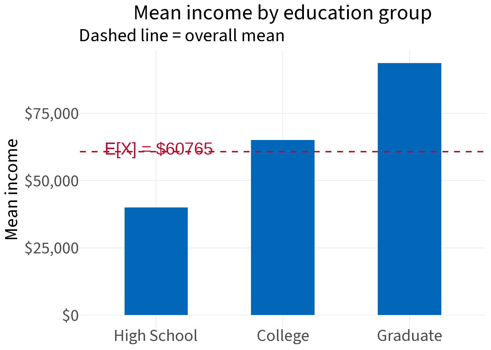
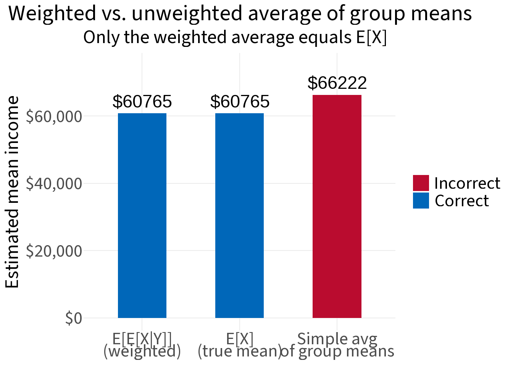

## The law

The **law of iterated expectations** (also called the tower property or Adam's law) states:

$$E[X] = E\big[E[X \mid Y]\big]$$

In words: the overall average of X equals the weighted average of the group-specific averages of X, where the weights are the group sizes.

This sounds obvious once you see it — but it's worth being precise about what "weighted average" means here, because a common mistake is to average group means without accounting for group size.

---

## The setup

We have a sample of 1,000 people. For each person we observe:

- **Y** — their highest level of education (High School, College, or Graduate)  
- **X** — their annual income (in USD)

Income tends to be higher for more educated workers, and the three groups are different sizes.


::: {.cell}

```{.r .cell-code}
set.seed(5842)

n <- 1000

education <- sample(
  c("High School", "College", "Graduate"),
  size    = n,
  prob    = c(0.40, 0.45, 0.15),
  replace = TRUE
)

income <- case_when(
  education == "High School" ~ rnorm(n, mean = 40000, sd = 8000),
  education == "College"     ~ rnorm(n, mean = 65000, sd = 12000),
  education == "Graduate"    ~ rnorm(n, mean = 95000, sd = 20000)
)

df <- data.frame(education, income)
head(df)
```

::: {.cell-output-display}

```{=html}
<table class="huxtable" data-quarto-disable-processing="true"  style="margin-left: auto; margin-right: auto;">
<col><col><thead>
<tr>
<th class="huxtable-cell huxtable-header" style="border-style: solid solid solid solid; border-width: 0.4pt 0pt 0.4pt 0.4pt;">education</th><th class="huxtable-cell huxtable-header" style="text-align: right;  border-style: solid solid solid solid; border-width: 0.4pt 0.4pt 0.4pt 0pt;">income</th></tr>
</thead>
<tbody>
<tr>
<td class="huxtable-cell" style="border-style: solid solid solid solid; border-width: 0.4pt 0pt 0pt 0.4pt;     background-color: rgb(242, 242, 242);">College</td><td class="huxtable-cell" style="text-align: right;  border-style: solid solid solid solid; border-width: 0.4pt 0.4pt 0pt 0pt;     background-color: rgb(242, 242, 242);">6.22e+04</td></tr>
<tr>
<td class="huxtable-cell" style="border-style: solid solid solid solid; border-width: 0pt 0pt 0pt 0.4pt;">Graduate</td><td class="huxtable-cell" style="text-align: right;  border-style: solid solid solid solid; border-width: 0pt 0.4pt 0pt 0pt;">1.04e+05</td></tr>
<tr>
<td class="huxtable-cell" style="border-style: solid solid solid solid; border-width: 0pt 0pt 0pt 0.4pt;     background-color: rgb(242, 242, 242);">College</td><td class="huxtable-cell" style="text-align: right;  border-style: solid solid solid solid; border-width: 0pt 0.4pt 0pt 0pt;     background-color: rgb(242, 242, 242);">7.67e+04</td></tr>
<tr>
<td class="huxtable-cell" style="border-style: solid solid solid solid; border-width: 0pt 0pt 0pt 0.4pt;">Graduate</td><td class="huxtable-cell" style="text-align: right;  border-style: solid solid solid solid; border-width: 0pt 0.4pt 0pt 0pt;">5.39e+04</td></tr>
<tr>
<td class="huxtable-cell" style="border-style: solid solid solid solid; border-width: 0pt 0pt 0pt 0.4pt;     background-color: rgb(242, 242, 242);">College</td><td class="huxtable-cell" style="text-align: right;  border-style: solid solid solid solid; border-width: 0pt 0.4pt 0pt 0pt;     background-color: rgb(242, 242, 242);">5.92e+04</td></tr>
<tr>
<td class="huxtable-cell" style="border-style: solid solid solid solid; border-width: 0pt 0pt 0.4pt 0.4pt;">Graduate</td><td class="huxtable-cell" style="text-align: right;  border-style: solid solid solid solid; border-width: 0pt 0.4pt 0.4pt 0pt;">8.56e+04</td></tr>
</tbody>
</table>

```

:::
:::


---

## Step 1: The overall mean E[X]

The overall mean income is straightforward:


::: {.cell}

```{.r .cell-code}
EX <- mean(df$income)
cat("E[X] = overall mean income: $", round(EX, 0))
```

::: {.cell-output .cell-output-stdout}

```
E[X] = overall mean income: $ 60765
```


:::
:::


---

## Step 2: The conditional means E[X | Y]

Now compute the mean income *within each education group*. This gives us E[X | Y] — a function of Y that assigns each person their group's average income.


::: {.cell}

```{.r .cell-code}
library(tidyverse)

group_stats <- df |>
  summarise(
    n       = n(),
    mean    = mean(income),
    .by     = education
  ) |>
  mutate(
    prop    = n / sum(n),
    education = factor(education, levels = c("High School", "College", "Graduate"))
  ) |>
  arrange(education)

group_stats
```

::: {.cell-output-display}

```{=html}
<table class="huxtable" data-quarto-disable-processing="true"  style="margin-left: auto; margin-right: auto;">
<col><col><col><col><thead>
<tr>
<th class="huxtable-cell huxtable-header" style="border-style: solid solid solid solid; border-width: 0.4pt 0pt 0.4pt 0.4pt;">education</th><th class="huxtable-cell huxtable-header" style="text-align: right;  border-style: solid solid solid solid; border-width: 0.4pt 0pt 0.4pt 0pt;">n</th><th class="huxtable-cell huxtable-header" style="text-align: right;  border-style: solid solid solid solid; border-width: 0.4pt 0pt 0.4pt 0pt;">mean</th><th class="huxtable-cell huxtable-header" style="text-align: right;  border-style: solid solid solid solid; border-width: 0.4pt 0.4pt 0.4pt 0pt;">prop</th></tr>
</thead>
<tbody>
<tr>
<td class="huxtable-cell" style="border-style: solid solid solid solid; border-width: 0.4pt 0pt 0pt 0.4pt;     background-color: rgb(242, 242, 242);">High School</td><td class="huxtable-cell" style="text-align: right;  border-style: solid solid solid solid; border-width: 0.4pt 0pt 0pt 0pt;     background-color: rgb(242, 242, 242);">376</td><td class="huxtable-cell" style="text-align: right;  border-style: solid solid solid solid; border-width: 0.4pt 0pt 0pt 0pt;     background-color: rgb(242, 242, 242);">4e+04&nbsp;&nbsp;&nbsp;&nbsp;&nbsp;&nbsp;&nbsp;</td><td class="huxtable-cell" style="text-align: right;  border-style: solid solid solid solid; border-width: 0.4pt 0.4pt 0pt 0pt;     background-color: rgb(242, 242, 242);">0.376</td></tr>
<tr>
<td class="huxtable-cell" style="border-style: solid solid solid solid; border-width: 0pt 0pt 0pt 0.4pt;">College</td><td class="huxtable-cell" style="text-align: right;  border-style: solid solid solid solid; border-width: 0pt 0pt 0pt 0pt;">444</td><td class="huxtable-cell" style="text-align: right;  border-style: solid solid solid solid; border-width: 0pt 0pt 0pt 0pt;">6.5e+04&nbsp;</td><td class="huxtable-cell" style="text-align: right;  border-style: solid solid solid solid; border-width: 0pt 0.4pt 0pt 0pt;">0.444</td></tr>
<tr>
<td class="huxtable-cell" style="border-style: solid solid solid solid; border-width: 0pt 0pt 0.4pt 0.4pt;     background-color: rgb(242, 242, 242);">Graduate</td><td class="huxtable-cell" style="text-align: right;  border-style: solid solid solid solid; border-width: 0pt 0pt 0.4pt 0pt;     background-color: rgb(242, 242, 242);">180</td><td class="huxtable-cell" style="text-align: right;  border-style: solid solid solid solid; border-width: 0pt 0pt 0.4pt 0pt;     background-color: rgb(242, 242, 242);">9.36e+04</td><td class="huxtable-cell" style="text-align: right;  border-style: solid solid solid solid; border-width: 0pt 0.4pt 0.4pt 0pt;     background-color: rgb(242, 242, 242);">0.18&nbsp;</td></tr>
</tbody>
</table>

```

:::
:::


::: {.cell}
::: {.cell-output-display}
{width=672}
:::
:::


---

## Step 3: E[E[X | Y]] — iterating the expectation

To get E[E[X | Y]], we take the expectation of the conditional mean over the distribution of Y. Since Y is discrete, this is a weighted average of group means, weighted by group proportions:

$$E\big[E[X \mid Y]\big] = \sum_y E[X \mid Y = y] \cdot P(Y = y)$$


::: {.cell}

```{.r .cell-code}
E_EXY <- sum(group_stats$mean * group_stats$prop)
cat("E[E[X|Y]] = $", round(E_EXY, 0))
```

::: {.cell-output .cell-output-stdout}

```
E[E[X|Y]] = $ 60765
```


:::
:::


---

## Step 4: Verify the law


::: {.cell}

```{.r .cell-code}
cat(
  "E[X]        = $", round(EX,    0), "\n",
  "E[E[X|Y]]  = $", round(E_EXY, 0), "\n",
  "Difference  =  ", round(EX - E_EXY, 6)
)
```

::: {.cell-output .cell-output-stdout}

```
E[X]        = $ 60765 
 E[E[X|Y]]  = $ 60765 
 Difference  =   0
```


:::
:::


They're equal (up to simulation noise). The law holds.

---

## The key pitfall: unweighted averages

A common mistake is to average group means *without* weighting by group size:


::: {.cell}

```{.r .cell-code}
unweighted_mean <- mean(group_stats$mean)

cat(
  "Weighted avg of group means   (correct): $", round(E_EXY,           0), "\n",
  "Unweighted avg of group means (wrong):   $", round(unweighted_mean, 0)
)
```

::: {.cell-output .cell-output-stdout}

```
Weighted avg of group means   (correct): $ 60765 
 Unweighted avg of group means (wrong):   $ 66222
```


:::
:::


These differ because the three groups are not the same size. High School (40%) and College (45%) workers outnumber Graduate (15%) workers. The unweighted average gives Graduate workers too much influence, pulling the result upward.


::: {.cell}
::: {.cell-output-display}
{width=672}
:::
:::


The law of iterated expectations is precise: the weights must come from the *marginal distribution of Y* — i.e., the actual proportion of people in each group.

---

## Why it works: decomposing the sum

We can see the arithmetic directly. The overall mean is just the total income divided by n:

$$E[X] = \frac{\sum_i x_i}{n} = \frac{\sum_y \left( \sum_{i: Y_i = y} x_i \right)}{n}$$

Within each group, the sum of incomes equals the group mean times the group size:

$$= \frac{\sum_y \bar{x}_y \cdot n_y}{n} = \sum_y \bar{x}_y \cdot \frac{n_y}{n} = \sum_y E[X \mid Y = y] \cdot P(Y = y)$$

That last expression is exactly $$E[E[X \mid Y]]$$.


::: {.cell}

```{.r .cell-code}
# Verify the arithmetic directly
group_stats |>
  mutate(contribution = mean * prop) |>
  summarise(
    `E[E[X|Y]]` = sum(contribution)
  )
```

::: {.cell-output-display}

```{=html}
<table class="huxtable" data-quarto-disable-processing="true"  style="margin-left: auto; margin-right: auto;">
<col><thead>
<tr>
<th class="huxtable-cell huxtable-header" style="text-align: right;  border-style: solid solid solid solid; border-width: 0.4pt 0.4pt 0.4pt 0.4pt;">E[E[X|Y]]</th></tr>
</thead>
<tbody>
<tr>
<td class="huxtable-cell" style="text-align: right;  border-style: solid solid solid solid; border-width: 0.4pt 0.4pt 0.4pt 0.4pt;     background-color: rgb(242, 242, 242);">6.08e+04</td></tr>
</tbody>
</table>

```

:::
:::


---

## Summary

The law of iterated expectations says the overall mean is the probability-weighted average of group means:

$$E[X] = E\big[E[X \mid Y]\big] = \sum_y E[X \mid Y = y] \cdot P(Y = y)$$

Three names, one idea:

| Name | Context |
|------|---------|
| Law of iterated expectations | Probability / statistics |
| Tower property | Measure-theoretic probability |
| Adam's law | Econometrics / applied statistics |

The key practical lesson: when averaging subgroup means to recover an overall mean, **weight by group size**. An unweighted average of group means is not the same as the population mean unless all groups are the same size.
