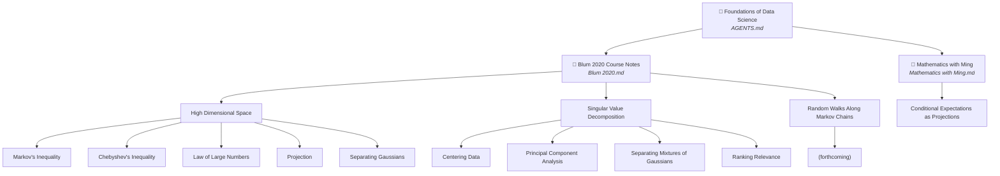

# Foundations of Data Science – Project Map

Full task map across all activities. Update when activities or tasks are added.

```mermaid
graph TD
    ROOT["📁 Foundations of Data Science<br/><i>AGENTS.md</i>"]

    ROOT --> BLUM["📄 Blum 2020 Course Notes<br/><i>Blum 2020.md</i>"]
    ROOT --> MWM["📁 Mathematics with Ming<br/><i>Mathematics with Ming.md</i>"]

    BLUM --> HDS["High Dimensional Space"]
    BLUM --> SVD["Singular Value Decomposition"]
    BLUM --> RW["Random Walks Along Markov Chains"]

    HDS --> MI["Markov's Inequality"]
    HDS --> CI["Chebyshev's Inequality"]
    HDS --> LLN["Law of Large Numbers"]
    HDS --> PROJ["Projection"]
    HDS --> SG["Separating Gaussians"]

    SVD --> CD["Centering Data"]
    SVD --> PCA["Principal Component Analysis"]
    SVD --> SMG["Separating Mixtures of Gaussians"]
    SVD --> RR["Ranking Relevance"]

    RW --> RW1["(forthcoming)"]

    MWM --> CEAP["Conditional Expectations as Projections"]
```
